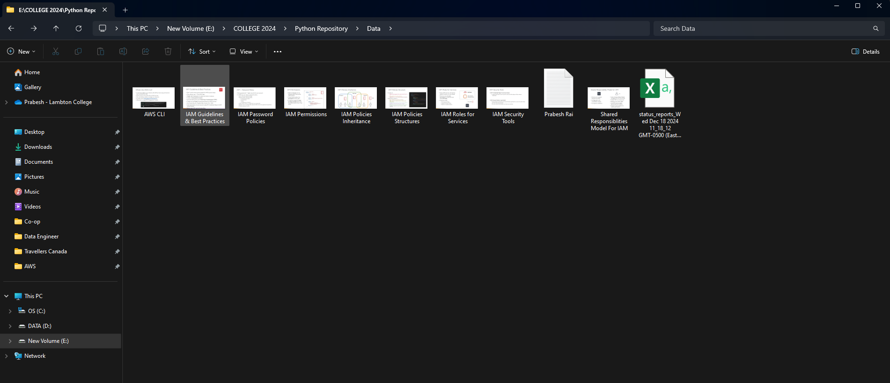
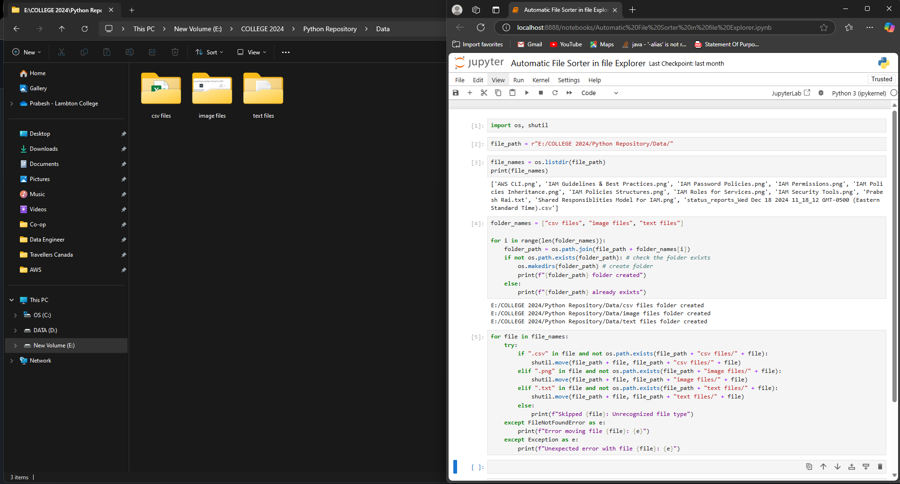

# 📂 Automatic File Sorter in File Explorer  

## 📝 Project Description  
The **Automatic File Sorter** is a Python script that organizes files in a specified directory based on their file type. It automatically moves files into categorized folders (e.g., CSV files, images, text files) to maintain an organized workspace and improve efficiency.  

## 🚀 Features  
✅ Automatically detects files in a folder  
✅ Creates categorized folders if they don't exist  
✅ Moves files to their respective folders (CSV, images, text files, etc.)  
✅ Prevents overwriting by checking for existing files  
✅ Reduces manual effort in file management  

## 🛠️ Technologies Used  
- **Python 3.x**  
- **os** (for file and folder operations)  
- **shutil** (for moving files)  
- **Jupyter Notebook** (for development and testing)  

## 📂 Folder Structure  
```
📁 Project Directory
│— 💜 Automatic File Sorter in File Explorer.ipynb
│— 💜 README.md
│— 📁 Data (Original Files)
│   ├── 📁 csv files
│   ├── 📁 image files
│   └── 📁 text files
```

## 🛠️ Installation & Setup  
1️⃣ **Install Python** (if not already installed) from [Python.org](https://www.python.org/)  
2️⃣ **Ensure Jupyter Notebook is installed**:  
   ```bash
   pip install notebook
   ```  
3️⃣ **Clone this repository** or download the script:  
   ```bash
   git clone https://github.com/yourusername/automatic-file-sorter.git
   ```  
4️⃣ **Navigate to the project directory**:  
   ```bash
   cd automatic-file-sorter
   ```  
5️⃣ **Open Jupyter Notebook and run the script**:  
   ```bash
   jupyter notebook
   ```  
   Open `Automatic File Sorter in File Explorer.ipynb` and execute the cells.  
   
## 🔄 How It Works  
1️⃣ The script scans a directory (`E:/COLLEGE 2024/Python Repository/Data/`) for files.  
2️⃣ It identifies files based on their extensions:  
   - `.csv` → Moved to `E:/COLLEGE 2024/Python Repository/Data/csv files/`  
   - `.png, .jpg` → Moved to `E:/COLLEGE 2024/Python Repository/Data/image files/`  
   - `.txt` → Moved to `E:/COLLEGE 2024/Python Repository/Data/text files/`  
3️⃣ If the categorized folder does not exist, it creates one.  
4️⃣ It moves each file to its respective folder, ensuring no overwrites.  

## 🖥️ Example Usage  
I have a folder with mixed files in `E:/COLLEGE 2024/Python Repository/Data/`:  
```
📁 Data
│— report.csv
│— photo.png
│— notes.txt
```
### Mixed files

After running the script, they will be sorted into:  
```
📁 Data
│— 📁 csv files
│   └── report.csv
│— 📁 image files
│   └── photo.png
│— 📁 text files
│   └── notes.txt
```
### Sorted files


## 🚀 Future Enhancements  
🔹 Add GUI using **Tkinter** for user-friendly file selection  
🔹 Support more file formats (PDF, videos, ZIP files, etc.)  
🔹 Automate running the script using **Task Scheduler** (Windows) or **Cron Jobs** (Linux)  
